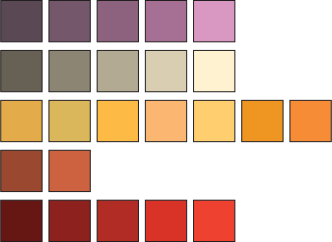

# sedlog-maker
Jupyter notebook based program for making basic sed logs.
This README is currently in a very basic state and will be improved when I find the time to do so. Apologies in the meantime.

## Requirements
This program should run on any fairly basic Python installation that has Jupyter available to it. The only packages the program imports are as follows:
- Numpy
- Pandas
- drawSvg

Of these, only drawSvg is likely to be missing from most Python users' installations. The package can be found here: [https://pypi.org/project/drawSvg/](https://pypi.org/project/drawSvg/)

## Running
This repo will work fastest when downloaded and run on your own machine. However, through the magic of technology, the entire thing can be run in the cloud through Binder using this link: . This performs much more slowly but you are borrowing the computing power of someone half way round the world so we can probably give them a break. Launching a Binder also takes some time to build, so please be patient and don't start refreshing your browser window.

## Basic use
To generate a sedimentary log, run the jupyter notebook (`sed-log.ipynb`) and follow the steps within. For help on how the functions operate, for now you'll have to look to the embedded docstrings in the `drawings.py` script until I create a proper manual.

## Examples
The `examples` directory contains two test data sets: `test_long.csv` and `test_varied.csv`, as well as example outputs generated from these files. Hopefully this will be enough idea of what I've hacked together to get you started.

## Default arrays
The program uses several default arrays with (what I consider) sensible and commonly used facies and grain sizes. The default colour scheme also gives every facies a different colour. The idea behind this is to make them easier to mass select when tidying up the output in a program like Inkscape or Illustrator. The default arrays are as follows:

### Default facies codes
The facies codes used here by default are an amalgam of those from Miall (1972) and DeCelles et al. (2011). See the end of the README for definitions. \
`f_codes = ["inaccessible","cov","fcm","fcl","fcr","fcrc","fcrw","fsm","fsl","fsr","fsrc","fsrw","sm","sh","sp","st","sr","src","srw","gmm","gmmi","gcm","gcmi","gcp","gct","gch"]`
### Default facies colours
Facies colours are provided as hex codes. The array is below, with an image to help those who can't visualise hex codes (which I hope is most people): \
`f_colors = ["#FFFFFF","#FFFFFF","#5A4854","#74576A","#8C627E","#A57093","#D998C1","#666154","#807969","#99917D","#B3A993","#CCC1A7","#E3AB4A","#DBB75C","#FDBB45","#FBB672","#FFCE6F","#EE9621","#F68C35","#99834F","#E5C376","#661714","#8D211D","#B22C26","#D93328","#EF4130"]`

### Default grain size codes
`grain_sizes = ["NaN","cl","si","vf","f","m","c","vc","gr","pebb","cobb","boul"]`
### Default grain size to width conversions
This array uses fractions to multiply the width of the log (by default 75 pt) to create the widths of the different grain sizes. As follows: \
`widths = [0.1,0.2, 0.3, 0.4, 0.45, 0.5, 0.55, 0.6, 0.7, 0.8, 0.9, 1.0]`

## Facies code definitions:
| Code | Facies |
|---|---|
|	inaccessible	|	Unit inaccessible (i.e., forms sheer cliffs)	|
|	cov	|	No exposure	|
|	fcm	|	Clay, massive	|
|	fcl	|	Clay, horizontally laminated	|
|	fcr	|	Clay, current ripples	|
|	fcrc	|	Clay, climbing ripples	|
|	fcrw	|	Clay, wave ripples	|
|	fsm	|	Silt, massive	|
|	fsl	|	Silt, horizontally laminated	|
|	fsr	|	Silt, current ripples	|
|	fsrc	|	Silt, climbing ripples	|
|	fsrw	|	Silt, wave ripples	|
|	sm	|	Sand, massive	|
|	sh	|	Sand, horizontally laminated	|
|	sp	|	Sand, planar cross-bedded	|
|	st	|	Sand, trough cross-bedded	|
|	sr	|	Sand, current ripples	|
|	src	|	Sand, climbing ripples	|
|	srw	|	Sand, wave ripples	|
|	gmm	|	Conglomerate, matrix supported, massive	|
|	gmmi	|	Conglomerate, matrix supported, massive, imbricated	|
|	gcm	|	Conglomerate, clast supported, massive	|
|	gcmi	|	Conglomerate, clast supported, massive, imbricated	|
|	gcp	|	Conglomerate, clast supported, planar cross-bedded	|
|	gct	|	Conglomerate, clast supported, trough cross-bedded	|
|	gch	|	Conglomerate, clast supported, horizontally laminated	|
